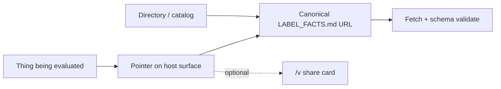

# Discovery and publication — suite contract

> How a consumer finds an xFacts label when the source tree is not visible.
> Complements [`PORTABLE-VIEWER-AND-FLIP.md`](./PORTABLE-VIEWER-AND-FLIP.md)
> (human share/skim) and per-label `SPEC.md` files (canonical file shape).

**Status:** normative suite guidance (v0.1).  
**Owner:** Catalyst Forge / xFacts suite.

---

## 1. The gap this closes

Each label defines a canonical `{LABEL}_FACTS.md` in source (repo root, toolset
package, skill package, model card directory). Portable `/v#…` viewers share a
human-readable card. Neither answers: **from the thing I am about to trust
(MCP install, skill marketplace, model card, agent product UI), where is the
fetchable label?**

AppFacts feels solved because the host surface *is* the public repo. MCP servers,
marketplace skills, hosted models, and agent configs often have no browsable root
at the moment of trust. Source placement alone is not discovery.

---

## 2. Three layers, one truth

| Layer | What | Who uses it |
|---|---|---|
| **Canonical artifact** | `{LABEL}_FACTS.md` (YAML frontmatter SoT) | Generators, git, validators, `--check` |
| **Pointer** | Host-native link or field → **canonical URL** | Humans and harnesses at decision time |
| **Viewer** | `https://{label}.dev/v#{prefix}.{payload}` | Humans only (skim, QR, copy) |

**Rule:** generators emit the file; publishers expose a pointer; `/v` is optional
sugar on the pointer.



### 2.1 Canonical URL

A dereferenceable `https://…` URL that returns the full `{LABEL}_FACTS.md` (or a
raw-git / package-served equivalent). Machines **MUST** prefer this over decoding
a `/v` fragment when both exist. Still self-asserted: verify-don’t-trust stands.

### 2.2 Viewer URL

Fragment-only portable card. May be truncated (especially ToolFacts). **MUST NOT**
be the primary machine API for hosts or harnesses when a canonical URL exists.
See suite value doc §7.6 and the portable-viewer spec.

### 2.3 Catalog URL

A directory or index entry (ModelFacts `/directory/` today; Tool/Agent crawls
later) used when no upstream pointer exists. Bootstrap and search — not a
replacement for publisher pointers.

---

## 3. Non-goals

| Non-goal | Why |
|---|---|
| Suite-hosted storage of third-party labels as SoT | Canonical files stay with publishers; directories are mirrors/seeds |
| Treating `/v#…` as proof or SoT | Untrusted user-controlled fragments; may be incomplete |
| Requiring every host to implement pointers before labels exist | Cold-start uses directories and exemplars; pointers are the adoption path |
| Replacing package-root file conventions | Well-known and registry fields are secondary discovery aids |

---

## 4. Normative cross-package refs

When one label references another (e.g. AgentFacts `tools.toolsets`, SkillFacts
`tools_referenced`, model pointers):

- **SHOULD** use an `https://` URL to the canonical `{LABEL}_FACTS.md`.
- Local/relative paths **MAY** appear in monorepos and local checkouts.
- Harnesses resolving labels across package boundaries **SHOULD** require URLs
  (or refuse to treat a bare path as published).

---

## 5. Per-label pointer homes

### 5.1 AppFacts

| | |
|---|---|
| **Canonical file** | Repo root `APP_FACTS.md` |
| **Primary pointer** | Public repository itself; README badge or link to raw file and/or `/v` |
| **Fallback** | `/.well-known/x-facts/app.md` on the product homepage when there is no public git root |

### 5.2 ModelFacts

| | |
|---|---|
| **Canonical file** | Model repo / model-card directory `MODEL_FACTS.md` |
| **Primary pointer** | Lab or hub model card link to that file; ModelFacts directory entry when seeded |
| **Cold-start** | [`modelfacts.dev/directory/`](https://modelfacts.dev/directory/) until labs link out |
| **Viewer** | Optional later (`mf1`); not required for discovery |

### 5.3 ToolFacts

| | |
|---|---|
| **Canonical file** | Toolset / MCP package root `TOOL_FACTS.md` |
| **Primary pointer** | MCP-facing surface: server README, registry metadata, and/or install config (`mcp.json` or docs) advertising a fetchable URL (recommended field name: `toolFactsUrl` / `tool_facts`) |
| **Consumer path** | Host resolves install target → ToolFacts URL → policy |
| **Composition** | AgentFacts `toolsets[]` **SHOULD** list ToolFacts URLs |
| **Fallback** | `/.well-known/x-facts/tool.md` on the server homepage; suite directory once crawl exists |

### 5.4 AgentFacts

| | |
|---|---|
| **Canonical file** | Next to shipped default agent config (or agent project root) `AGENT_FACTS.md` |
| **Primary pointer** | Product docs and host “about this agent” / attach UI |
| **Composition** | Graph of pointers: `toolsets` and model refs **SHOULD** be canonical URLs |
| **Fallback** | `/.well-known/x-facts/agent.md` on the product homepage |

### 5.5 SkillFacts

| | |
|---|---|
| **Canonical file** | Skill package root `SKILL_FACTS.md` (beside `SKILL.md` / equivalent) |
| **Primary pointer** | Marketplace listing or publish manifest link; install-time checklist: fetch SkillFacts before enable |
| **Viewer** | Optional marketplace “nutrition card” via `/v#sf1.…` |
| **Fallback** | `/.well-known/x-facts/skill.md` when the skill is web-hosted without a package root |

---

## 6. Well-known fallback

For web-hosted products with a homepage but no public package/git root, publishers
**MAY** serve:

```
https://{homepage}/.well-known/x-facts/{app|model|tool|agent|skill}.md
```

Same Markdown + YAML frontmatter as the package-root file. Secondary to the
per-label primary pointer; do not invent a second SoT — either the well-known URL
*is* the canonical URL, or it redirects to it.

---

## 7. Generator and harness expectations

**Generators SHOULD:**

1. Write `{LABEL}_FACTS.md` to the conventional path.
2. Print the **canonical URL** (when known: public raw URL, homepage well-known, or
   publisher-supplied) and, when a portable payload is produced, the **viewer URL**.

**Hosts and harnesses SHOULD:**

1. Resolve the pointer on the install/attach surface.
2. Fetch the canonical URL and validate against the label schema.
3. Ignore `/v` fragments for policy decisions when a canonical URL is available.

**Unlabeled:** treating missing labels as max caution is a *product opinion*, not a
suite mandate (see ToolFacts roadmap).

---

## 8. Cold-start

Until hosts grow first-class pointer fields:

1. Deploy label sites so schema, `llms.txt`, and exemplars resolve.
2. Seed directories (ModelFacts pattern; Tool/Agent crawl next).
3. Dogfood: every CF/ForgeKit demo ends with a canonical URL and optionally a `/v`
   card.
4. Seed AGENTS.md / ForgeKit bootstraps to fetch family `llms.txt` and follow
   exemplar `viewer` / file links.

Directories do not remove the need for publisher pointers; they bridge the empty
years.

---

## 9. Success criterion

A stranger evaluating an MCP, skill, agent, or model can answer **where is the
label URL?** without opening an invisible source tree — and a harness can fetch
that URL without scraping HTML or decoding a `/v` fragment.

---

## 10. Related

| Doc | Role |
|---|---|
| Per-label `SPEC.md` | File shape; each adds a short Publication & discovery pointer here |
| [`PORTABLE-VIEWER-AND-FLIP.md`](./PORTABLE-VIEWER-AND-FLIP.md) | `/v` share surface |
| [`SUITE-VALUE-AND-NETWORK-EFFECTS.md`](./SUITE-VALUE-AND-NETWORK-EFFECTS.md) §7.4, §7.6 | Discovery is not automatic; viewers are not trust |
| [`ROADMAPS.md`](./ROADMAPS.md) | Sequencing; shared work includes this contract |

---

## License

Documentation for the open suite.
